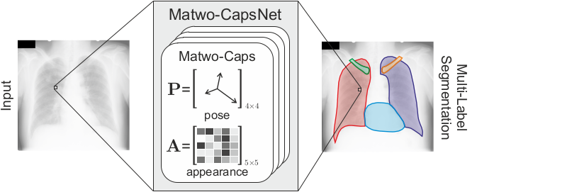
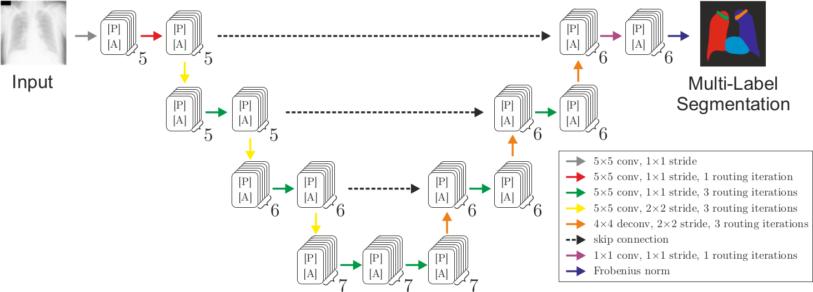

# Matwo-CapsNet
Implementation of the MICCAI 2019 Paper "Matwo-CapsNet: a Multi-Label Semantic Segmentation Capsules Network". 


## Matwo-Caps



## SRC Multi-Label segmentation Dice score

|      Method        | Parameters |        Loss          |  Left lung  | Right lung  | Left clavicule | Right clavicule | Heart | 
|:------------------:|:----------:|:--------------------:|:-----------:|:-----------:|:--------------:|:---------------:|:-----:|
|       U-Net        |    42K     |       Softmax        |  97.36      | 97.87       | 90.87          | 90.64           | 94.49 |
|      SegCaps       |   2,129K   |   weighted Softmax   |  21.18      | 35.79       | 4.49           | 2.93            | 32.83 |
|      SegCaps       |   2,129K   | weighted Spread loss |  30.74      | 0           | 0.06           | 0               | 23.23 |
| MatVec-CapsNet O_r |    43K     |     Spread loss      |  95.57      | 96.43       | 82.89          | 82.56           | 92.37 |
| MatVec-CapsNet D_r |    43K     |     Spread loss      |  96.60      | 97.15       | 86.41          | 86.38           | 93.42 |
|    Matwo-CapsNet   |    43K     |     Spread loss      |  97.01      | 97.45       | 88.32          | 87.82           | 94.37 |

## Architecture


## Dataset preprocessing
Download the files from :

- [JSRT dataset](http://db.jsrt.or.jp/eng.php)
- [SRC dataset](https://www.isi.uu.nl/Research/Databases/SCR/download.php)
 
Extract the archives in `./Dataset` before running `./Dataset/dataset_preprocessing.py`

## Train models
Run `main_train_and_test.py` to train the network. You can run any of the paper experiment by simply uncommenting the different settings at the end of the script.

## Train and test other datasets
In order to train and test on other datasets, modify the `dataset.py` file. See the example files and documentation for the specific file formats. Set the parameter `save_debug_images = True` in order to see, if the network input images are reasonable.

## Citation
If you use this code for your research, please cite our [Paper]():

```
@inproceedings{Bonheur2019,
  title     = {Matwo-CapsNet: a Multi-Label Semantic Segmentation Capsules Network},
  author    = {Bonheur, Savinien and {\v{S}}tern, Darko and Payer, Christian and Pienn, Michael and Olschewski, Horst and Urschler, Martin},
  booktitle = {Medical Image Computing and Computer-Assisted Intervention - {MICCAI} 2019},
  doi       = {},
  pages     = {},
  year      = {2019},
}
```

## References
This code make use of the following projects:

[Framework](https://github.com/christianpayer/MedicalDataAugmentationTool)
```
@inproceedings{Payer2018a,
  title     = {Multi-label Whole Heart Segmentation Using {CNNs} and Anatomical Label Configurations},
  author    = {Payer, Christian and {\v{S}}tern, Darko and Bischof, Horst and Urschler, Martin},
  booktitle = {Statistical Atlases and Computational Models of the Heart. ACDC and MMWHS Challenges. STACOM 2017},
  doi       = {10.1007/978-3-319-75541-0_20},
  pages     = {190--198},
  year      = {2018},
}
```

[Segcaps](https://github.com/lalonderodney/SegCaps)
```
@article{lalonde2018capsules,
  title={Capsules for Object Segmentation},
  author={LaLonde, Rodney and Bagci, Ulas},
  journal={arXiv preprint arXiv:1804.04241},
  year={2018}
}
```
## Special Requirement:

-cachetools 2.1.0
